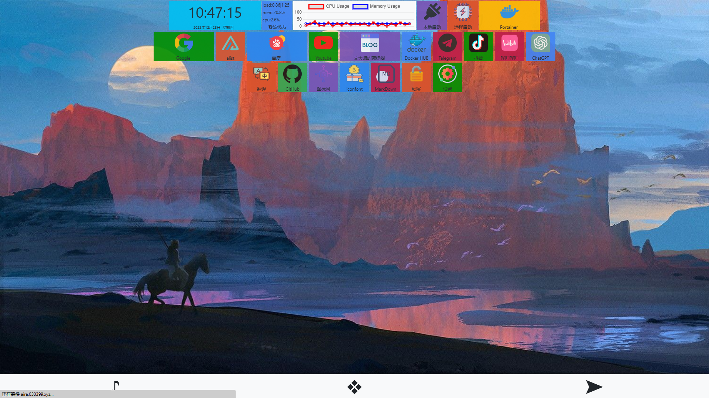
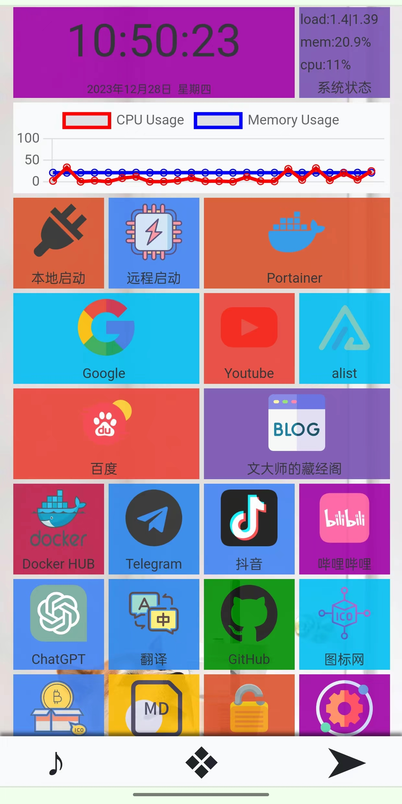

# statsMenu
### NAS开始页





### 它能做什么?

###### 书签管理
###### 翻译
###### 性能监控

### 如何启动?

克隆项目到本地

```bash
git clone https://github.com/mekwenby/statsMenu.git
```

安装依赖

```bash
pip install -r requirements.txt
```

DeBUG启动

```bash
python app.py
```

正式启动

编辑run.py 文件第32行

Windows 使用 run(False)

Linux 使用 run(True)

```python
if __name__ == "__main__":
    # 单进程 + 协程 适应 Windows
    run(False)
    # 多进程 + 协程 适应 Linux
    #run(True)
```

```bash
python run.py
```

本项目支持 Docker-Compose

```
docker-compose up -d
```


### 配置百度翻译API

编辑config.yaml 文件

填写正确的Baidu_Translate_appid和Baidu_Translate_appkey

API申请:https://api.fanyi.baidu.com/

```yaml
Baidu_Translate_appid: '20230*********'
Baidu_Translate_appkey: '*************_qD'
```


### 设置锁屏密码和Cookie过期时间

编辑config.yaml 文件

```yaml
Lock_screen_password: '1324'	# 锁屏密码
Password_validity_period: 86400	# 过期时间
```

### 添加书签

通过 设置-获取SDK 下载书签模板并编辑

```yaml
name: Youtube
genre: link
serial: 2
value: 'https://www.youtube.com/'
ico_genre: 'image'
ico_size: 1
ico_value: '174883.png'

# name        应用名称
# genre       应用类型,目前只支持link
# value       link  的值
# ico_genre   图标类型 支持 text 和 image
# ico_size    图标大小 支持 1 或者 2
# ico_value   图标的值 支持文本或者 图标名称
```

通过 设置-添加应用图标 上传书签图标

通过 设置-安装应用程序 上传编辑后的.yaml 文件 并重构应用列表

### 以后会做什么?

SSH登录工具

远程下载

文件管理

自动任务